# TaskHub – Admin Module Management & Store Documentation

> **Version:** 1.0  **Updated:** 2025-07-17 19:42

This document explains how TaskHub discovers, displays, installs, and manages modules from both local sources and the global _TaskHub Store_.  
The information is aimed at core contributors and third–party developers who want to extend TaskHub or integrate Copilot‑assisted tooling into their workflow.

---

## 1  High‑Level Overview

| Concern | Responsibility |
|---------|----------------|
| **Module overview** (`admin.modules`) | List installed modules, their status, dependencies, and actions. |
| **Module store** (`admin.modules.store`) | Search the global JSON registry, preview modules, add them to the install‑queue. |
| **Installation queue** (`admin.modules.install`) | Download package (Composer / Git), run activation, stream live logs. |

All major screens are powered by **Livewire** for instant feedback without full page refreshes.

---

## 2  Directory Layout

```
app/Http/Controllers/Admin/Modules
    ├─ ModuleController.php      # Overview, details, enable/disable
    ├─ StoreController.php       # Store search & metadata lookup
    └─ InstallController.php     # Composer/Git queue + live log

app/Livevire/Admin/Modules/
   ├─ Index.php           # modules.index
   ├─ Show.php            # modules.show (accordion body)
   ├─ Store.php           # modules.store search UI
   └─ InstallLog.php      # log modal

resources/views/admin/modules/
   ├─ index.blade.php
   ├─ show.blade.php
   ├─ store.blade.php
   └─ install-log.blade.php
```

---

## 3  Routing

```php
// routes/admin.php
Route::middleware(['auth:admin'])
     ->prefix('admin')
     ->name('admin.')
     ->group(function () {

    Route::prefix('modules')->name('modules.')->group(function () {

        // Store
        Route::get('/store', [StoreController::class, 'store'])->name('store');
        Route::post('/lookup', [StoreController::class, 'lookup'])->name('lookup');  // AJAX

        // Installation queue
        Route::post('/install', [InstallController::class, 'queue'])->name('install');
        Route::get('/install/{uuid}',[InstallController::class, 'log'])->name('install.log');

        // Overview & details
        Route::get('/', [ModuleController::class,'index'])->name('index');
        Route::get('/{slug}', [ModuleController::class, 'show'])->name('show');
    });
});
```

> **Tip:** `ModuleController` can be a **single‑action controller** (`__invoke`) delegating heavy lifting to Livewire components.

---

## 3.1  Module Discovery & Caching (Hybrid Approach)

TaskHub uses a **hybrid approach** for module management:

- **Filesystem scan**: On every "Rescan" action, or when a module is installed/removed, TaskHub scans the `modules/` directory (and optionally `vendor/`) for available modules. Each module must have a `module.json` or `composer.json` with metadata.
- **Database cache**: The result of the scan is cached in a `modules` database table. This table stores metadata (slug, name, version, status, enabled/disabled, etc.) for fast lookups, filtering, and status tracking.
- **GUI/menus**: The admin GUI and menus always use the database cache for performance. Any action (enable, disable, delete, rescan) updates both the filesystem and the database.

**Typical workflow:**
1. User clicks "Rescan" or performs an action (enable/disable/delete) in the module admin.
2. TaskHub scans the filesystem for modules, parses their metadata, and updates the `modules` table.
3. The GUI reloads from the database cache for instant feedback.

**Why this approach?**
- Always up-to-date after a rescan or install/uninstall
- Fast filtering, searching, and status display in the admin
- No risk of stale data after module changes

**Example migration for `modules` table:**
```php
Schema::create('modules', function (Blueprint $table) {
    $table->id();
    $table->string('slug')->unique();
    $table->string('name');
    $table->string('version')->nullable();
    $table->string('status')->default('enabled'); // enabled, disabled, error
    $table->string('path');
    $table->json('meta')->nullable(); // All other metadata from module.json
    $table->timestamps();
});
```

**Sync logic (pseudo):**
```php
// On rescan or install/uninstall:
$modules = [];
foreach (glob(base_path('modules/*/module.json')) as $jsonFile) {
    $meta = json_decode(file_get_contents($jsonFile), true);
    $modules[] = [
        'slug' => basename(dirname($jsonFile)),
        'name' => $meta['name'] ?? basename(dirname($jsonFile)),
        'version' => $meta['version'] ?? 'n/a',
        'status' => 'enabled',
        'path' => dirname($jsonFile),
        'meta' => $meta,
    ];
}
// Upsert into modules table
```

**Admin GUI always uses the `modules` table for listing, filtering, and actions.**

---

## 4  Controllers

### 4.1  ModuleController

```php
class ModuleController
{
    public function __invoke()  // GET admin.modules
    {
        return Inertia::render('Admin/Modules/Index');
    }

    public function show(string $slug)
    {
        return inertia('Admin/Modules/Show', [
            'module' => Module::withRelations()->findBySlugOrFail($slug)
        ]);
    }
}
```

### 4.2  StoreController

Responsible for registry sync and metadata lookup **without downloading full source**.

```php
class StoreController
{
    public function __invoke() {
        return inertia('Admin/Modules/Store');
    }

    public function lookup(ModuleLookupRequest $r)
    {
        // Detect composer vs git, call RegistryService, return JSON
    }
}
```

### 4.3  InstallController

```php
class InstallController
{
    public function queue(InstallRequest $r)
    {
        // Dispatch InstallModuleJob, return UUID
    }

    public function log(string $uuid)
    {
        return response()->stream(function () use ($uuid) {
            LogStreamer::stream($uuid);
        });
    }
}
```

---

## 5  Livewire Components

| Component | Description |
|-----------|-------------|
| **Index** | Accordion list of installed modules. Header shows version, status, and dependency icons:<br>⚓ _needs others_ • 🛡️ _required by others_. |
| **Show**  | Renders README, composer/module.json, full dependency tree. |
| **Store** | Search‑as‑you‑type against local registry cache (`index.json`) and shows result cards with preview & **Install**. |
| **InstallLog** | Subscribes to `install.log` endpoint and streams composer output in near real‑time. |

---

## 6  Views

### 6.1  `index.blade.php`

```blade
<x-admin-layout title="Modules">
    <livewire:admin.modules.index />
</x-admin-layout>
```

Accordion rows:

```
┌────────────────────────────────────────────────┐
│ Client Management   v1.4.2   🛡️ ⚓   • Active │
└────────────────────────────────────────────────┘
▼ (Show component)
```

### 6.2  `store.blade.php`

Includes:

* Search input (debounced)
* Filter pills (All • Packagist • Git • Local)
* Grid of module cards (Tailwind)

### 6.3  `install-log.blade.php`

Modal or side‑drawer that shows coloured streaming output (`stdout`, `stderr`) from the job.

---

## 7  Menu Registration

Seeder example:

```php
Menu::firstOrCreate([
    'key'   => 'modules',
    'label' => 'Modules',
    'icon'  => 'puzzle',
    'route' => 'admin.modules',
]);

Menu::firstOrCreate([
    'parent_key' => 'modules',
    'key'        => 'modules.store',
    'label'      => 'Store',
    'route'      => 'admin.modules.store',
]);
```

---

## 8  Registry Sync

```bash
php artisan taskhub:sync-store
```

* Scheduler entry:*  
```php
$schedule->command('taskhub:sync-store')->daily();
```

- Downloads `https://taskhub.no/store/index.json`.
- Saves to `storage/app/taskhub-store.json`.
- Updates `module_registry` database table.

---

## 9  Installation Workflow

```mermaid
graph TD
U[Click Install] --> Q[Queue Job]
Q --> C{Composer or Git?}
C -->|Composer| R[composer require]
C -->|Git| G[git clone into modules/]
R --> A[taskhub:activate <slug>]
G --> A
A --> M[Run Migrations]
M --> P[Permissions & Menu]
P --> V[Clear caches]
V --> S{Success?}
S -->|Yes| OK[Mark Active ✔]
S -->|No| RB[Rollback + notify]
```



Rollback deletes vendor/cloned files and rolls back last migration batch.

---

## 10  Dependency Icons

| Icon | Condition | Tooltip |
|------|-----------|---------|
| ⚓    | `depends_on` has entries | “Requires: td‑clients ≥1.2” |
| 🛡️    | Other modules list this in their `depends_on` | “Used by: SLA, Tickets” |

---

## 11  .ENV Requirements

If `module.json` contains:

```json
"env_required": [
  "ACME_API_KEY",
  "ACME_API_SECRET"
]
```

the Store card shows a small `.env` badge. Hover displays the key names so the admin knows to update `.env`.

---

## 12  Troubleshooting

| Symptom | Resolution |
|---------|------------|
| Install fails | See `storage/logs/taskhub-install.log` and job output. |
| Version conflict | Livewire toast shows composer constraint error; upgrade or uninstall conflicting module. |
| Registry unavailable | Retry `taskhub:sync-store`; if offline, the last cached `index.json` is used. |

---

## 13  Future Enhancements

1. Paid modules and license validation  
2. Real‑time REST registry instead of JSON file  
3. Automatic “Update available” banner  
4. Screenshot carousel in Store cards  

---

*Happy coding — TaskHub Core Team*
